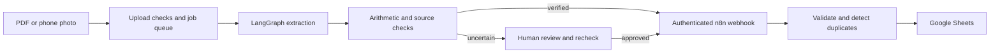

# Synq Paperwork Robot

**Invoice extraction, deterministic checks, human review and an n8n / Google Sheets handoff.**

Built by **Bosko Tutnjilovic**, founder of [Synq Logic](https://synqlogic.com), as an applied AI automation portfolio project.

Invoice entry is repetitive, but a confidently wrong extraction can be expensive. This Python prototype reads digital PDFs and scanned invoices, checks its output against arithmetic and source evidence, and sends uncertain records to a password-protected review portal. Only verified or explicitly approved records reach the Sheets integration.

## What employers can inspect

- **LangGraph pipeline:** page reading, bounded rereading, and a second-reader / referee path for scanned text.
- **Validation beyond prompts:** invoice totals, line arithmetic, PDF text positions and interpretation of ambiguous extra columns.
- **Human review:** original page images beside editable fields, highlighted uncertainty, rechecking and explicit approval.
- **Integration boundaries:** authenticated webhook, another validation layer in n8n, duplicate checks and raw-value Sheets writes.
- **Case study:** [how the system was designed, measured and where it falls short](docs/case-study.md), including acceptance criteria, an integration contract, latency per invoice and what blocks real use.
- **Offline tests and synthetic fixtures:** extraction checks, portal authorization, upload limits, review and save behavior without calling an AI provider or Google Sheets.



## Evidence and limits

The repository contains **nine generated invoices with answer keys**: two layouts, 1 / 5 / 30-page documents, and digital / scanned variants. They contain synthetic data.

A recorded local run on **September 27, 2026** matched **3,844 of 3,875 expected lines (99.2%)**. Eight invoices were verified; the 30-page scanned classic invoice needed review. Its 31 incorrect extracted lines were flagged; 33 lines were flagged in total. No unflagged incorrect lines or incorrectly verified invoices were observed **on this small synthetic set**. See [the evaluation summary](docs/evaluation.md). This is not a production accuracy claim, a financial audit, or evidence of client time savings.

## Quick start

Requires Python 3.12+ and [uv](https://docs.astral.sh/uv/).

```bash
git clone https://github.com/skabo42000/synq-paperwork-robot.git
cd synq-paperwork-robot
uv sync --locked
uv run pytest -q
```

The tests use fake readers and a fake Sheets sender. **No credentials or external service calls are needed for tests.**

To run the actual portal:

1. Copy `.env.example` to `.env` (`Copy-Item .env.example .env` in PowerShell).
2. Set a random `PORTAL_PASSWORD` of at least 12 characters.
3. Set your own Gemini API key (`GOOGLE_API_KEY_DEV` takes precedence if supplied).
4. Configure a **test** n8n workflow and Sheet following [the integration guide](n8n/README.md). Leave the webhook blank until you want writes; a verified invoice then reports a save failure rather than writing elsewhere.

```bash
uv run uvicorn synq_paperwork.app:app --host 127.0.0.1 --port 8000
```

Open `http://localhost:8000`. Upload a file from `testdata/invoices/`. Actual extraction sends document content to the configured AI provider and may incur costs. Verified files are automatically sent to the configured webhook; flagged files require approval. Start with synthetic documents and your own test Sheet.

## Walkthrough

1. Run the offline tests to see successful saves, duplicate handling and a flagged invoice through fake integrations.
2. With your own integrations configured, upload a one-page synthetic invoice and inspect the extracted fields and checks.
3. Open any record marked **needs review**, compare its flagged lines with the page image, correct them and recheck.
4. Approve only after checking the source. The override for supplier arithmetic errors is explicit and recorded.
5. Inspect the Sheet and try the same document again to observe the duplicate check.

## Project map

| Path | Purpose |
|---|---|
| `src/synq_paperwork/pipeline.py` | Graph orchestration and verification report |
| `checks.py`, `columns.py`, `crosscheck.py` | Deterministic rules and independent readings |
| `app.py`, `jobs.py`, `static/` | Authenticated upload and review portal / local queue |
| `sheets.py`, `n8n/` | Verified / approved data handoff |
| `testdata/`, `tests/` | Generated invoices, answer keys and offline tests |
| `evals.py` | Provider-based evaluation against answer keys |

## Evaluation commands

```bash
# Makes external model calls; start with a one-page fixture.
uv run python -m synq_paperwork.evals checked 1p
```

Full evaluations can make many model requests. Outputs remain under ignored `evals/results/`; private uploads remain under ignored `data/`.

## Deployment and security

This is a **single-user local prototype**. A shared portal password is not tenant isolation. The queue and document store are local; uploads remain on disk until deleted. Public deployment needs access control, request / cost limits, encrypted storage, retention rules, backups and operational monitoring. Duplicate checks in Sheets are not a transactional guarantee under concurrent writes. Treat uploaded documents as untrusted and retain human review for consequential decisions.

Read [SECURITY.md](SECURITY.md) before using real documents. Public workflow exports have credentials and tenant identifiers removed and are inactive until you configure them.
